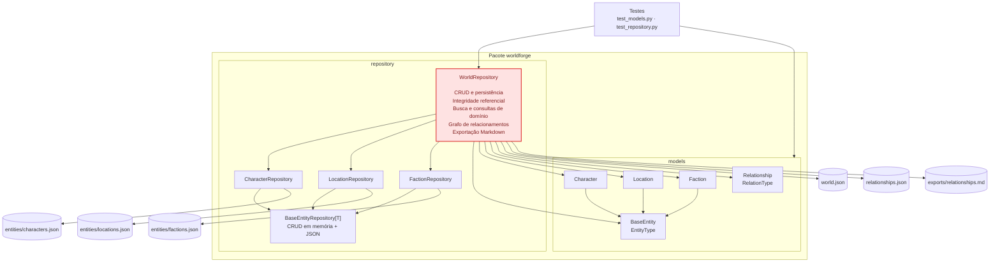

```mermaid
flowchart TB
    Tests["Testes<br/>test_models.py · test_repository.py"]

    subgraph Core["Pacote worldforge"]
        subgraph Models["models"]
            Base["BaseEntity<br/>EntityType"]
            Character["Character"]
            Location["Location"]
            Faction["Faction"]
            Relationship["Relationship<br/>RelationType"]
            Character --> Base
            Location --> Base
            Faction --> Base
        end

        subgraph Repository["repository"]
            BaseRepo["BaseEntityRepository[T]<br/>CRUD em memória + JSON"]
            CharRepo["CharacterRepository"]
            LocRepo["LocationRepository"]
            FacRepo["FactionRepository"]
            WorldRepo["WorldRepository<br/><br/>CRUD e persistência<br/>Integridade referencial<br/>Busca e consultas de domínio<br/>Grafo de relacionamentos<br/>Exportação Markdown"]
            CharRepo --> BaseRepo
            LocRepo --> BaseRepo
            FacRepo --> BaseRepo
            WorldRepo --> CharRepo
            WorldRepo --> LocRepo
            WorldRepo --> FacRepo
        end
    end

    Tests --> Models
    Tests --> WorldRepo
    WorldRepo --> Base
    WorldRepo --> Character
    WorldRepo --> Location
    WorldRepo --> Faction
    WorldRepo --> Relationship

    WorldRepo --> WorldJson[("world.json")]
    CharRepo --> CharactersJson[("entities/characters.json")]
    LocRepo --> LocationsJson[("entities/locations.json")]
    FacRepo --> FactionsJson[("entities/factions.json")]
    WorldRepo --> RelationshipsJson[("relationships.json")]
    WorldRepo --> Markdown[("exports/relationships.md")]

    classDef hotspot fill:#fee2e2,stroke:#dc2626,stroke-width:2px,color:#7f1d1d;
    class WorldRepo hotspot;
```